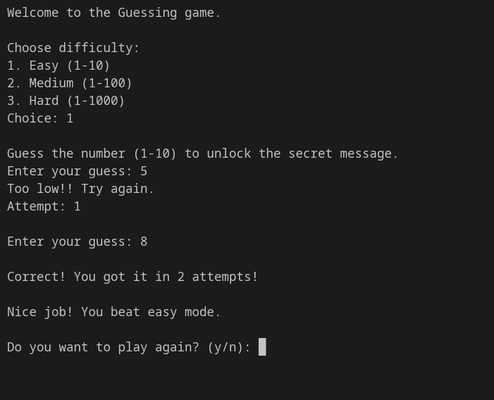

# 🎯 Guessing Game (C++)

A simple console-based number guessing game made in C++. The goal is to guess the randomly generated number and unlock a special reward depending on the difficulty you complete.

This was a fun little project to practise:

* C++ basics
* User input and output
* Loops
* Conditional statements
* Switch statements
* Random number generation
* Basic terminal effects

## 🎮 How to Play

1. Run the program.
2. Choose a difficulty:

   * **Easy** → Guess a number between 1 and 10
   * **Medium** → Guess a number between 1 and 100
   * **Hard** → Guess a number between 1 and 1000
3. Enter your guesses until you find the secret number.
4. Try to beat the game with the fewest attempts possible.
5. Choose whether you want to play again.

## ✨ Features

* Three difficulty levels
* Randomly generated secret numbers
* Attempt counter
* Helpful hints:

  * "Too high"
  * "Too low"
* Replay option
* Special victory message for each difficulty
* Secret ASCII art reward for beating hard mode

---
# 📸 Screenshot

Interactive shell mode:



---

## 🛠️ Built With

* C++
* Standard Library:

  * `<iostream>`
  * `<cstdlib>`
  * `<ctime>`

## 🚀 How to Run

### 1. Clone the repository

```bash
git clone https://github.com/Xyt564/number-guessing-game.git
```

### 2. Navigate into the project folder

```bash
cd number-guessing-game/
```

### 3. Compile the program

Using g++:

```bash
g++ main.cpp -o guessing_game
```

### 4. Run the game

Windows:

```bash
guessing_game.exe
```

Linux/macOS:

```bash
./guessing_game
```

## 📸 Gameplay Preview

Example:

```
Welcome to the Guessing game.

Choose difficulty:
1. Easy (1-10)
2. Medium (1-100)
3. Hard (1-1000)
Choice: 1

Guess the number (1-10) to unlock the secret message.

Enter your guess: 10
Too high!! Try again.
Attempt: 1

Enter your guess: 5
Too high!! Try again.
Attempt: 2

Enter your guess: 2
Too low!! Try again.
Attempt: 3

Enter your guess: 4

Correct! You got it in 4 attempts!

Nice job! You beat easy mode.

Do you want to play again? (y/n):
```

## 🧠 Future Improvements

Some ideas for future updates:

* Add a scoring system
* Add a leaderboard
* Add difficulty settings with custom ranges
* Add a timer
* Improve input validation
* Add more rewards and secrets
* Create a graphical version

## 📜 License

> Check LICENSE file

---

Made with C++ and curiosity 🚀
